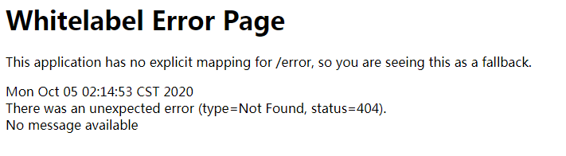

##Q1:
https://blog.csdn.net/li_ainy/article/details/87277695

##Q2:如何快速找到指定端口被哪个程序占用并释放该端口
https://blog.csdn.net/HumorChen99/article/details/81030330

##Q3：如何配置多注册中心
单击模拟时需要修改对用的hosts 才可在一台电脑模拟集群 

https://zhuanlan.zhihu.com/p/76582106 

https://blog.csdn.net/xcbeyond/article/details/81503484 

https://www.jianshu.com/p/5613212e91bb

##Q4: 开启认证以后服务提供者频繁注册不到注册中心
https://www.cnblogs.com/JamieLove/p/11087564.html

https://www.cnblogs.com/idoljames/p/11622343.html

http://c.biancheng.net/view/5325.html

##Q5:单机如何搭建高可用 multi-eureka 
需要修改对用的hosts 才可在一台电脑模拟集群 https://zhuanlan.zhihu.com/p/76582106 https://blog.csdn.net/xcbeyond/article/details/81503484 https://www.jianshu.com/p/5613212e91bb

修改hosts文件添加如下

    # for multi-eureka begin
    127.0.0.1 center-master
    127.0.0.1 center-second
    127.0.0.1 center-third
    # for multi-eureka end

##Q6:Eureka高可用，节点均出现在unavailable-replicas下
    1.eureka.client.serviceUrl.defaultZone配置项的地址，不能使用localhost，要使用域名，DNS解析请自行配置。
    
    2.spring.application.name要一致（这个个人测试默认不配也可以）
    
    3.如下两个参数需配为true（个人测试默认不配也可行）
    eureka:
      client:
        register-with-eureka: true
        fetch-registry:  true
    
    4.配置eureka.instance.hostname(好像看到过正常eureka会自动拉取设备host，但各节点在同一机器下时请务必添加，注意各节点配置自己节点的host)
    eureka:
      instance:
        hostname:host1
    作者：A雪_辰A链接：https://www.jianshu.com/p/59c54ccc6ba6
